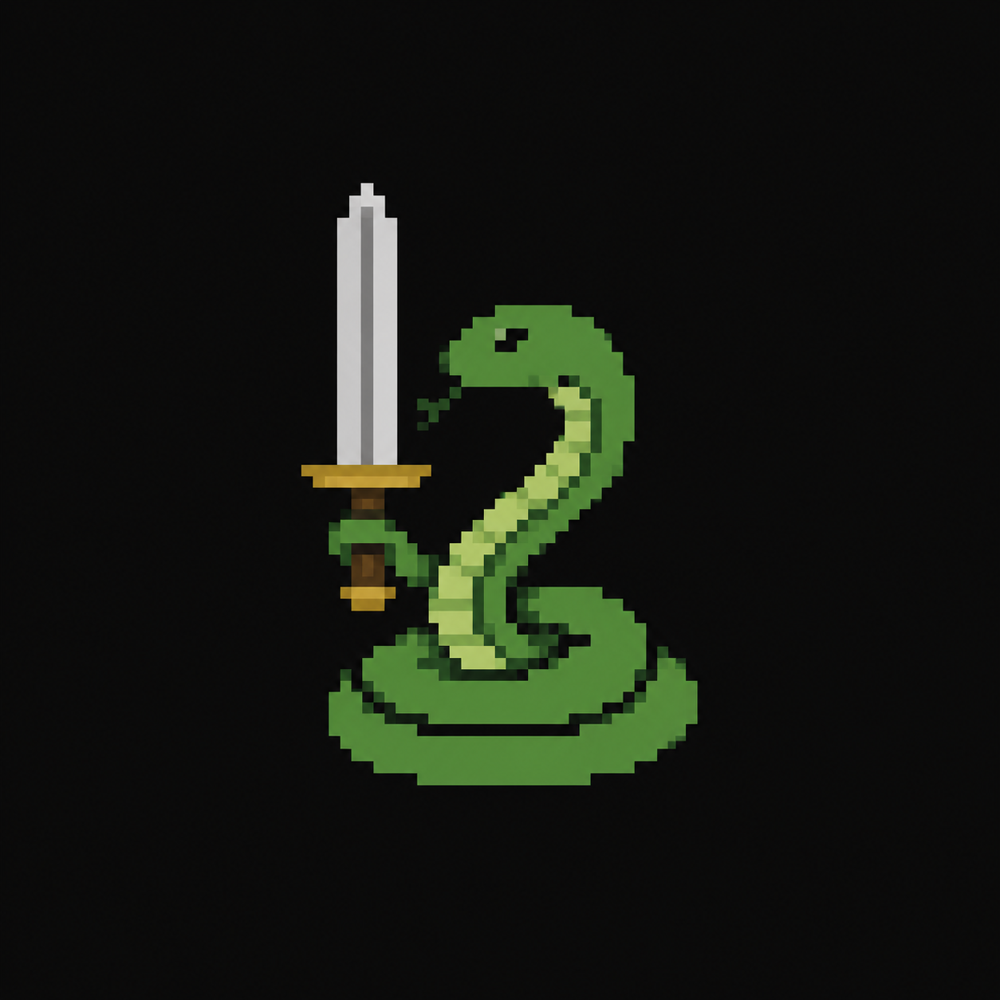

# ATACofthesnake

Downstream processing of ATAC data, including QC, differential accessibility -, LRT - and timecourse analyses. Optional downstream motif analyses included.
Starting point are deduplicated BAM and/or CRAM files.

## Important

All samples in a 'run' have to belong to the same group. That means that out of all peaks/sample, a union will be made. In case this is not relevant, you can run the workflow multiple times.
Fasta headers un field 0 (space delimited) are not allowed to contain a pipe character '|' (as peaks will be delimited as such).

## Installation

From pypi:
>  pip install ATACofthesnake  

or with uv:
>  uv pip install ATACofthesnake  

From github:
>  git clone git@github.com:maxplanck-ie/ATACofthesnake.git  
>  pixi run ATAC -h  

## Quickstart

 > ATAC -h

Bare minimum needed input:
 - directory with deduplicated bam and/or cram files.  
 - genome fasta file  
 - genome annotation file (GTF format)  
 - read attracting regions (BED format), this is necessary and needs to contain at least the full mitochondrial chromosome.  

For more details and how-to on requesting specific differential analysis and comparisons, please refer to the [documentation](https://atacofthesnake.readthedocs.io/en/stable/).
